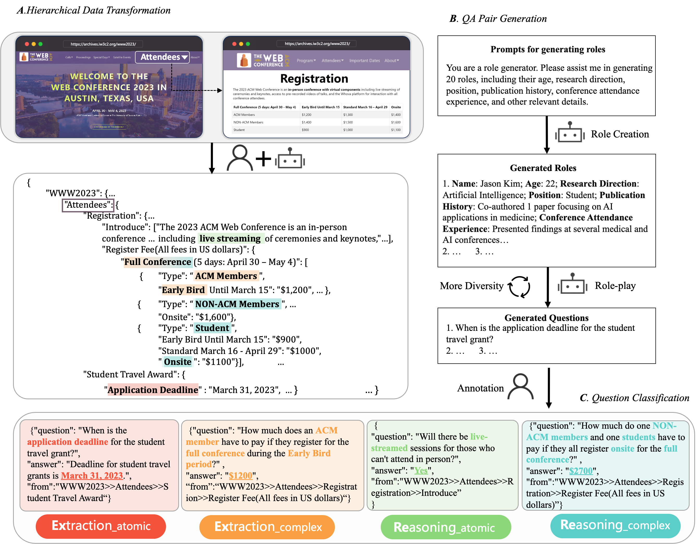
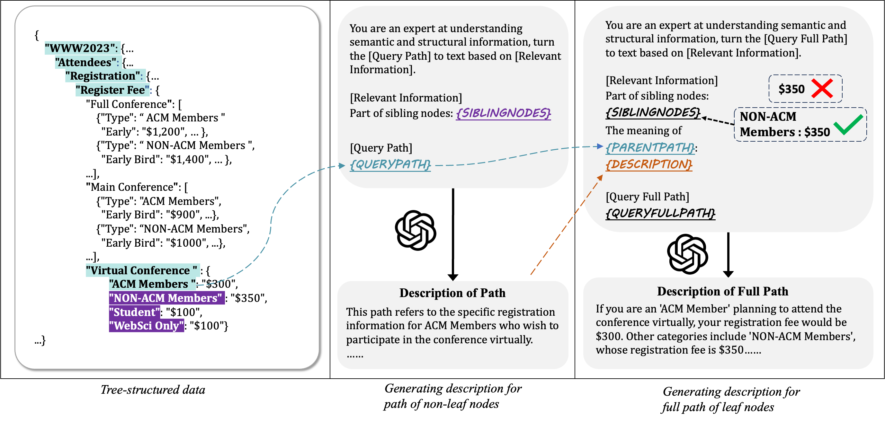

# ConferenceQA

ConferenceQA is a dataset created for the academic conference question-answering task, containing information from 7 different conferences organized in a tree-structured format. Each conference comes with nearly 100 manually annotated question-answer pairs, categorized into four types based on the nature of the answers. The aim of this dataset is to enhance the capability of large language models in processing queries related to academic conferences, particularly in terms of knowledge accuracy, enabling researchers and developers to better study and develop in this area. 

## Data Collection Method

<p align="center">
    <a> </a>
<p>

### Hierarchical Data Transformation

Data transformation in the ConferenceQA dataset aims to unify diverse formats of academic conference data sourced from official websites. This includes both unstructured plain text and structured table data. We use a semi-automated method to construct tree-structured data for each conference. Structured table data is converted using ChatGPT, while web crawlers handle other structured data like accepted papers. Manual annotation of inter-page relationships ensures dataset quality. Ultimately, seven conference datasets in a tree-structured format are obtained, serving as accurate knowledge sources.

### QA Pair Generation

This process aims to generate trustworthy question-answer pairs through role creation, LLM-generated Questions, and manual annotation. Using ChatGPT, we simulate conference participants' roles to generate relevant questions, which are then manually filtered and annotated with answers and their sources to ensure realism and reliability. Initially, we create 20 roles, each resembling real-life researchers with diverse backgrounds and interests in conferences. With these roles, we engage ChatGPT in role-playing scenarios, prompting it to generate five questions of varying granularity about each conference. To enhance question diversity, we iteratively prompt the model. Finally, through manual annotation, we review and filter out duplicate or unrealistic questions, annotating answers based on our tree-structured data. Each answer's source is meticulously identified within the conference's data, ensuring the dataset's reliability.

### Question Classification

To assess the model's ability to answer questions of varying difficulty, we designed a categorization scheme based on two aspects: the process of generating the answer and the number of entries involved in generating the correct answer.

The first dimension is *extraction* or *reasoning*, considering the process of generating an answer.
- *extraction*: The answer can be directly extracted from the dataset, i.e., the answer is a text fragment from the dataset.
- *reasoning*: The model needs to reason first and then generate an answer, i.e., the corresponding answer is not a text from the dataset.

The second dimension is *atomic* or *complex*, mainly considering the number of entries involved in generating the correct answer.
- *atomic*: Generating the answer only requires information from a single entry.
- *complex*: Generating the answer requires information from multiple entries.
These two dimensions combine to form four categories from simple to difficult: *extraction atomic*, *extraction complex*, *reasoning atomic*, *reasoning complex*. This classification is used to test the model's question-answering ability under different complexities and reasoning requirements.

## Data Content
Here is a part of the tree-structured data for WWW2023:
```json
{
    "WWW2023": {
        "Home": {
            "name": "WWW2023",
            "date": "APRIL 30 - MAY 4, 2023",
            "location": "Austin, Texas, US. AT&T Hotel and Conference Center at The University of Texas at Austin",
            "full name": "The Web Conference",
            "introduction": "Since the invention of the World Wide Web in 1989, The Web Conference (formerly known as International World Wide Web Conference, abbreviated as WWW) is a yearly international academic conference on the topic of the future direction of the World Wide Web. This conference has been the premier venue to present and discuss progress in research, development, standards, and applications of the topics related to the Web. Over the past three decades, The Web Conference has been the forum where some of the most fundamental Web technologies have been introduced, such as the Anatomy of a Large Scale Web Search Engine in 1998 prefiguring Google, the EigenTrust algorithm in 2003 and the YAGO knowledge base in 2007 (see also the Test of Time Award past recipients). The conference assembles scholars, researchers, policymakers, practitioners, and end-users with one unifying goal: to envision and create the future of the Web.",
            "ACM A.M. Turing Award Lecture": {
                "name": "Bob Metcalfe",
                "affiliation": "MIT"
            },
            "keynotes": [
                {
                    "name": "Barbara Poblete",
                    "affiliation": "University of Chile and Amazon Visiting Academic"
                },
                {
                    "name": "David Rand",
                    "affiliation": "MIT"
                },
                {
                    "name": "Payal Arora",
                    "affiliation": "Erasmus University Rotterdam"
                },
                {
                    "name": "Zachary Elkins",
                    "affiliation": "UT Austin"
                },
                {
                    "name": "Michalis Vazirgiannis",
                    "affiliation": "LIX, Ecole Polytechnique"
                }
            ],
          "..."
        },
      "..."
    },
  "..."
}
```

Here is a corresponding QA pair and the path of the answer in the JSON:
```json
{
    "question": "What is the date of the WWW2023 conference?", 
    "answer": "From April 30, 2023 to May 4, 2023.",
    "from": "WWW2023/Home/date"
},
```

## STAR (STructure-Aware Retrieval) Method

We designed a method that integrates structural and linguistic information to better handle the academic conference question-answering task. The primary approach is to generate text descriptions using GPT and design different combinations for the generated text descriptions. Below is an illustrative diagram of this method.
<p align="center">
    <a> </a>
<p> 

## Usage
### Installing Dependencies
To install the dependencies for the project, follow these steps:

1. **Download the Project Code:** Open a terminal and navigate to the directory where you want to save the project. Then use Git to clone the repository of the project.

    ```bash
    git clone xxx
    ```

2. **Install Dependencies:** Enter the project directory and use pip to install the dependencies listed in the requirements.txt file.

    ```bash
    cd your_repository
    pip install -r requirements.txt
    ```

### Modify OpenAI API Key 

Go to the gpt.py file in the utils directory, and fill in the two API keys in the corresponding positions under this function:
```python
def get_api_key(idx: int = 0):
    if idx == 0:
        # your openai api key, for text-embedding-ada-002
        pass 
    elif idx == 1:
        # your openai api key, for gpt
        pass
```

## File Structure

```
ConferenceQA/
│
├── dataset/                                  # 数据目录
│   └── WWW                                   # WWW2023数据集
│       ├── WWW2023.json                      # WWW2023 json数据
│       ├── extraction_atomic.json            # EA类型QA
│       ├── extraction_complex.json           # EC类型QA
│       ├── reasoning_atomic.json             # RA类型QA
│       └── reasoning_complex.json            # RC类型QA
│   ...                                       # 其他会议数据
│
├── utils/                                    # 工具函数目录
│   ├── api_request_parallel_processor.py     # 多协程调用api
│   ├── cal_sim.py                            # 计算相似度
│   ├── gpt.py                                # 调用gpt接口
│   ├── logging.py                            # 输出日志信息
│   └── cluster.py                            # 聚类
│
├── figures/                                  # 图片目录
│
├── conferenceqa.py                           # 数据预处理
├── encoder.py                                # 编码器
├── get_bm25.py                               # BM25结果
├── eval_bm25.py                              # 测试BM25结果
├── get_origin.py                             # 获得原始输出
├── evaluate.py                               # 测试模块
├── retrieve.py                               # 检索模块
├── main.py                                   # 主函数入口
│
└── requirements.txt                          # 项目依赖文件
```


